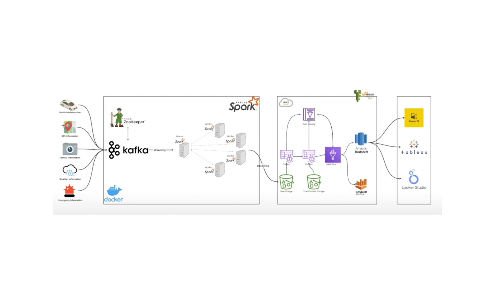

# 🚀 Smart City Real-Time Data Streaming & Analytics Pipeline

## 📌 **Project Overview**

This project implements a real-time data streaming pipeline for a Smart City initiative, capturing and analyzing data from a vehicle traveling between London and Birmingham. It processes GPS coordinates, vehicle diagnostics, weather conditions, emergency alerts, and camera feeds to extract valuable insights.

### 🛠 Key Technologies Used:
- **IoT Devices** for real-time data collection
- **Apache Kafka** for event-driven data streaming
- **Apache Spark** for large-scale data processing
- **AWS Services** (S3, Glue, Athena, Redshift) for cloud storage & querying
- **Data Visualization** with **Power BI, Tableau, Looker Studio, and QuickSight**

## 🏗️ **System Architecture**

## 📂 **Project Workflow**

### 1️⃣ Data Collection & Ingestion
📌 **Process:**
- IoT devices capture **real-time GPS locations, vehicle stats, weather conditions, and emergency reports**.
- Data is **streamed into Kafka topics**, managed via **Docker containers**.

🛠 **Tools Used:**
- **IoT Sensors** (data sources)
- **Apache Kafka** (message queue)
- **Apache Zookeeper** (cluster coordination)
- **Docker** (containerization)

### 2️⃣ Real-Time Data Processing
📌 **Process:**
- **Apache Spark Streaming** reads data from Kafka topics.
- Data is **cleaned, transformed, and stored in AWS S3 as Parquet files**.
- **Checkpointing** is enabled for fault-tolerance.

🛠 **Tools Used:**
- **Apache Spark** (real-time computation)
- **Python (PySpark)** (data transformation)

📈 **Outcome:** A scalable, fault-tolerant pipeline optimized for fast data processing.

### 3️⃣ Data Storage & Schema Extraction
📌 **Process:**
- Processed data is stored in **AWS S3**.
- **AWS Glue** extracts metadata and catalogs the data.

🛠 **Tools Used:**
- **AWS S3** (data lake)
- **AWS Glue** (data cataloging & ETL)

📈 **Outcome:** A structured data repository ready for fast querying and analytics.

### 4️⃣ Data Querying & Insights
📌 **Process:**
- **AWS Athena** runs SQL queries on the processed data.
- **Amazon Redshift** enables high-performance analytics.

🛠 **Tools Used:**
- **AWS Athena** (serverless querying)
- **Amazon Redshift** (data warehousing)

📈 **Outcome:** Instant, cost-effective querying without infrastructure overhead.

### 5️⃣ Interactive Data Visualization
📌 **Process:**
- Data is visualized through **Tableau**.
- Dashboards provide **real-time trends, emergency alerts, and vehicle tracking insights**.
🛠 **Tools Used:**
- Amazon QuickSight
- Tableau
📈 **Outcome:** Clear, actionable insights for **traffic management, emergency response, and urban planning**.

## 🚀 **Getting Started**

### Prerequisites
✅ **Install Required Tools**:
- Docker & Docker Compose
- Apache Kafka & Apache Spark
- Python 3.x
- AWS Account with IAM Permissions

## **Setup Instructions**

1️⃣ Clone the Repository
```
git clone https://github.com/yourusername/smart-city-streaming.git
cd smart-city-streaming
```
2️⃣ Configure Docker
- Ensure **Docker & Docker Compose** are installed.
- Configure **Kafka & Spark** inside ```docker-compose.yml```.
- Start the services:
```
docker-compose up -d
```
3️⃣ AWS Configuration
- Set up **IAM roles** and permissions.
- Configure **S3, Glue, and Athena** for data storage.
- Update **AWS credentials **in config files.

4️⃣ Run Data Ingestion
- Start Kafka Producer to send IoT data streams:
```python main.py```

5️⃣ Run Spark Streaming Job
- Submit the Spark Streaming Job to process and write data to S3:
```python spark-city.py```

6️⃣ Query Data with Athena
- Run SQL queries on **AWS Athena** to extract insights.

7️⃣ Visualize in QuickSight/Tableau
- Load processed data and build **interactive dashboards**.

## 🎯 Key Takeaways
✅ Low-latency streaming → Real-time ingestion with Kafka & Spark <br>
✅ Scalable cloud storage → AWS S3 & Glue for structured data <br>
✅ Fast query execution → Serverless analytics with Athena & Redshift <br>
✅ Actionable urban insights → Traffic optimization, emergency detection, and vehicle analytics


